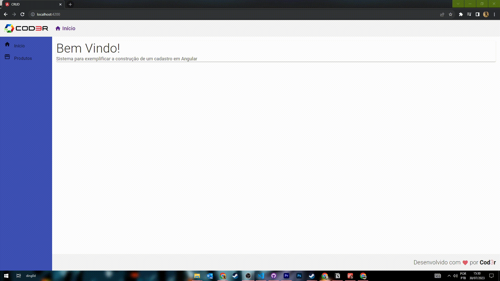

<h1 align="center">
Seja Bem-vindo! 🙋‍♂️
</h1>

<h2 align="center">
    
</h2>

<br>

## Tecnologias

Lista de tecnologias utilizadas no projeto:

- [Angular](https://angular.io/)
- [JSON Server](https://github.com/typicode/json-server)

## Como Executar o Projeto

Para executar o projeto localmente em sua máquina, siga as etapas abaixo:

1. Certifique-se de ter o Node.js e o Angular CLI instalados em sua máquina.

2. Clone este repositório para sua máquina local usando o seguinte comando:

```bash
$ git clone https://github.com/brendonhenrrique/Aplicacao-de-Cadastro--CRUD--Com-Angular.git
```

3 .Navegue até a pasta do projeto e instale as dependências usando o seguinte comando:
```bash
npm install
```

4. Inicie a aplicação com o Angular CLI:
```bash
ng serve
```
5. Acesse a aplicação em seu navegador da web através do seguinte endereço:
```bash
http://localhost:4200/
```
 
Para ativar o banco de dados db.json:

1. Acesse a pasta backend e use o seguinte comando: 
```bash
npm install
```

2. Agora para startar o banco de dados simulado no db.json digite o seguinte comando:
```bash
npm start
```

Agora, você pode testar as funcionalidades de CRUD da aplicação localmente usando o banco de dados simulado db.json.
## Sobre o Projeto

O projeto "CRUD usando Angular com Banco de Dados Local db.json" é uma aplicação web desenvolvida para realizar operações básicas de CRUD (Create, Read, Update, Delete) em um banco de dados simulado chamado db.json. O CRUD é uma abreviação para as quatro principais operações que podem ser realizadas em qualquer sistema de gerenciamento de dados - criar (Create), ler (Read), atualizar (Update) e excluir (Delete) registros.

Nesta aplicação, utilizamos o framework Angular para criar uma interface amigável e responsiva, permitindo aos usuários interagir com os dados de forma simples e intuitiva.

Projeto foi desenvolvido durante o Curso **[Web Moderno Completo com JavaScript 2020 + Projetos](https://www.udemy.com/share/1013eS3@QCG18scCQqKNc5ybG1CiBN0iZc6bBJbMi3PLX4HS0JMbfl6WBv5s_cq_UMlwksMU4w==/)**.

## Funcionalidades

● Create (Criar): Os usuários têm a capacidade de adicionar novos registros ao banco de dados simulado através de um formulário de criação.

● Read (Ler): A aplicação exibe os registros existentes em uma lista, permitindo que os usuários visualizem todas as informações armazenadas no banco de dados.

● Update (Atualizar): Os usuários podem editar os registros existentes através de um formulário de atualização, permitindo que eles façam alterações nos dados existentes.

● Delete (Excluir): A aplicação possibilita que os usuários removam registros indesejados do banco de dados simulado.

● Banco de Dados Local: Para fins de teste, implementamos um banco de dados simples denominado db.json, que opera apenas localmente. Essa abordagem nos permite simular as operações CRUD sem a necessidade de uma conexão com um banco de dados remoto.

## License

Esse projeto está sob a [licença MIT](LICENSE.md).

---